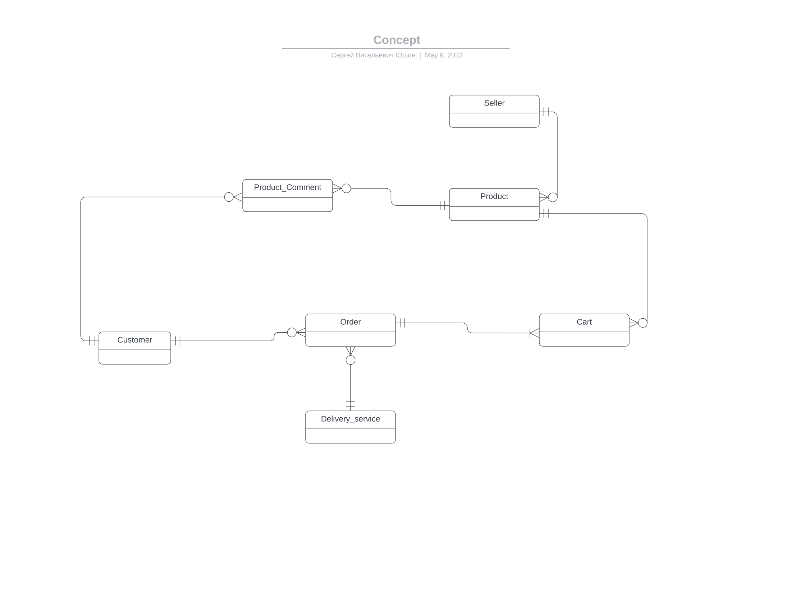
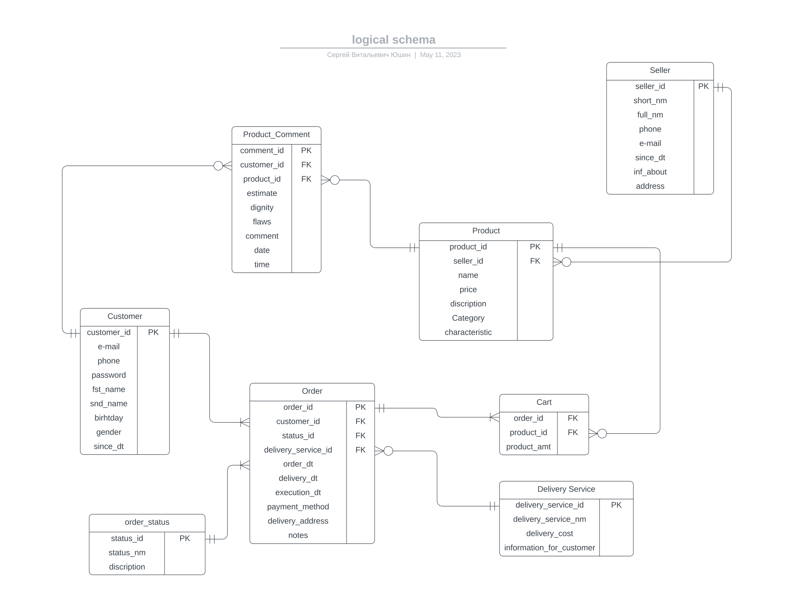

# Проект Маркетплейс
Имеется база данных маркетплейса. В ней имеется информация о покупателях, продавцах товаров и самих товарах, службе доставки, а также информация о заказах(покупках, и различных дополнительных деталях заказа покупателей).
## Концептуальная схема

## Логическая схема

Данная база данных представлена схемой <b>marketplace_database</b>, в которой присутствуют следующие сущности:

# .seller
Таблица "seller", содержит информацию о продавце:
- seller_id - идентификатор продавца (первичный ключ);
- short_nm - краткое наименование продавца;
- full_nm - полное наименование продавца;
- phone - телефон продавца;
- e_mail - электронная почта продавца;
- since_dt - дата регистрации продавца;
- inf_about - информация о продавце;
- address - адрес продавца.

# .customer 
Таблица "customer", содержит информацию о покупателе:
- customer_id - идентификатор покупателя (первичный ключ);
- e_mail - электронная почта покупателя;
- phone - телефон покупателя;
- pasword - пароль покупателя;
- fst_name - имя покупателя;
- snd_name - фамилия покупателя;
- birhtday - дата рождения покупателя;
- genger - пол покупателя;
- since_dt - дата регистрации покупателя.

# .product
Таблица "product", содержит информацию о товаре:
- product_id - идентификатор товара (первичный ключ);
- category - категория товара;
- seller_id - идентификатор продавца, который продает данный товар (внешний ключ);
- name - наименование товара;
- price - цена товара;
- description - описание товара;
- characteristic - характеристики товара.

# .order_status
Таблица "orderstatus", содержит информацию о статусе заказа:
- status_id - идентификатор статуса заказа (первичный ключ);
- status_nm - наименование статуса заказа;
- discription - описание статуса заказа.

# .delivery_service
Таблица "delivery_service", содержит информацию о службе доставки:
- delivery_service_id - идентификатор службы доставки (первичный ключ);
- delivery_service_nm - наименование службы доставки;
- delivery_service_cost - стоимость доставки;
- information_for_customer - информация для покупателя.

# .order
Таблица "order", содержит информацию о заказе:
- order_id - идентификатор заказа (первичный ключ);
- customer_id - идентификатор покупателя (внешний ключ);
- status_id - идентификатор статуса заказа (внешний ключ);
- delivery_service_id - идентификатор службы доставки (внешний ключ);
- order_dt - дата и время заказа;
- delivery_dt - дата и время доставки;
- execituon_dt - дата и время выполнения заказа;
- payment_method - способ оплаты;
- delivery_address - адрес доставки;
- notes - примечания.

# .cart
Таблица "cart", содержит информацию о корзине заказа:
- order_id - идентификатор заказа (внешний ключ);
- product_id - идентификатор товара (внешний ключ);
- product_amt - количество товара в корзине.

# .product_amt
Таблица "productcomment", содержит информацию о комментариях к товару:
- comment_id - идентификатор комментария (первичный ключ);
- customer_id - идентификатор покупателя (внешний ключ);
- product_id - идентификатор товара (внешний ключ);
- estimate - оценка товара;
- dignity - достоинства товара;
- flaws - недостатки товара;
- comment - комментарий к товару;
- timedate - дата и время комментария.

В директории проекта <b>docs</b> представлены концептуальная и логические схемы маркетплейса, а в директории <b>scripts</b> можно найти ddl запросы, создающие и заполняющие базу данных информацией.